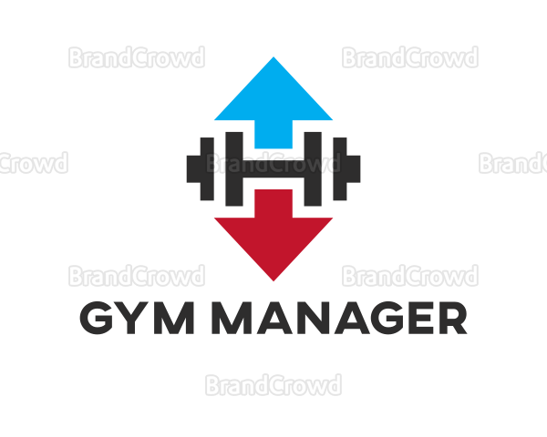

<h1 align="center">
    
</h1>

<blockquote align="center">“Your only limit is you!”</blockquote>

  

  

  

  

## 🧐 About

The project aims to give administrators control over instructors and affiliated members of the gym.

## :rocket: Stack
 - HTML
 - CSS
 - JavaScript
 - NodeJS

## :wrench: Dependencies
 - 
 - 
 - 
 - 
 - 
 - 

<blockquote alt="[ignore]">
  

    This project comes from Rocketseat's launch base bootcamp, and it is only for study purposes. The brand, logo and name are non professional
  

</blockquote>
